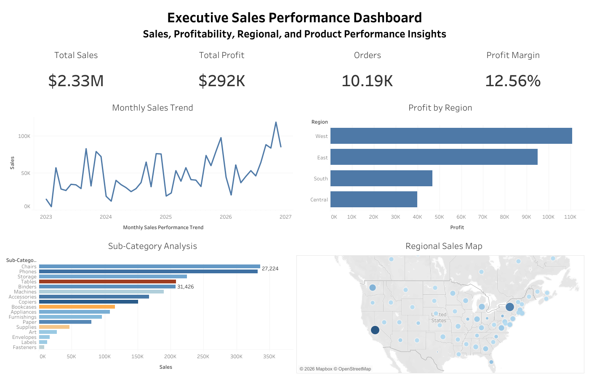

# Executive Sales Performance Dashboard

Interactive Tableau dashboard analyzing sales performance, profitability trends, regional insights, and product category performance using the Global Superstore dataset.

---

## Project Overview

This project focuses on building an executive-level business intelligence dashboard using Tableau. The dashboard provides interactive visual analysis of sales, profit, regional performance, and product category insights to support strategic business decision-making.

The objective of this project is to demonstrate advanced data visualization, storytelling, KPI reporting, and analytical thinking skills commonly required for Data Analyst and Business Intelligence roles.

---

## Dashboard Preview



---

## Tableau Public

View the interactive dashboard here:

[Executive Sales Performance Dashboard](https://public.tableau.com/app/profile/data.analyst.iqbal/viz/ExecutiveSalesPerformanceDashboard_17785588068340/ExecutiveSalesDashboard)

---

## Business Questions

This dashboard is designed to answer the following business questions:

- Which regions generate the highest profitability?
- How does sales performance trend over time?
- Which product categories contribute the most revenue and profit?
- Which sub-categories underperform despite strong sales?
- How are sales and profitability distributed geographically?
- What operational inefficiencies can be identified from the data?

---

## Key Features

- Executive KPI Overview
- Monthly Sales Trend Analysis
- Regional Profitability Comparison
- Product Category Performance Analysis
- Sub-Category Profitability Analysis
- Geographic Sales Visualization
- Interactive Dashboard Layout
- Business Storytelling with Data

---

## Dashboard Highlights

- Interactive executive-level dashboard
- Regional profitability analysis
- Product category performance insights
- Geographic sales distribution
- KPI-driven business monitoring
- Business storytelling with visualization

---

## KPI Metrics

The dashboard includes the following key performance indicators:

- Total Sales
- Total Profit
- Total Orders
- Profit Margin %

---

## Business Insights

Advanced global operations and executive-level performance insights extracted from the multi-regional interactive Tableau model:

* **Regional Profit Decoupling:** While top-line revenue shows global expansion, net profitability is highly concentrated in specific regional engines. Certain high-volume territories suffer from severe margin leakage, proving that high sales velocity does not automatically translate to bottom-line health due to localized operational overheads.
* **Sub-Category Margin Destruction:** Granular product portfolio mapping reveals a critical mismatch where specific sub-categories (such as Tables or Supplies) generate massive sales volume but yield negative net profits. This structural drain is heavily driven by unoptimized shipping costs or aggressive regional promotional discounts.
* **Geographic Value Clusters:** Macro-level geographic visualization exposes distinct high-value demand pockets versus widespread, low-yield operational drains. This clear contrast flags immediate opportunities to redirect capital away from low-density territories into hyper-profitable hubs.
* **Macro Demand Cyclicality:** Global transaction trends exhibit highly predictable seasonal surges, peaking aggressively toward the end of the fiscal year. This macro timeline demands synchronized cross-border inventory readiness and optimized freight capacity management.

---

## Strategic Recommendations

Actionable, data-backed playbooks designed for Executive Leadership and Supply Chain Operations to defend global margins and maximize capital efficiency:

* **Execute Sub-Category Rationalization or Freight Surcharges:** Protect the global profit margin by restructuring the pricing model for high-volume, negative-profit sub-categories. Implement distance-based freight surcharges or limit their distribution in regions with high logistical friction.
* **Surgical Capital & Marketing Re-allocation:** Shift regional customer acquisition budgets away from low-margin, high-overhead territories and double down on identified high-density geographic profit clusters to maximize Return on Ad Spend (ROAS).
* **Implement Regionalized Discount Caps:** Address margin erosion by applying programmatic, country-specific discount ceilings within Tableau monitoring parameters, ensuring promotional campaigns do not accidentally push high-volume products into net-negative returns.
* **Synchronize Pre-Peak Inventory Influx:** Standardize a global supply chain playbook that triggers automated warehouse fulfillment and logistics scaling 45 days prior to the historical demand surge to prevent stockouts and capitalize on peak transactional velocity.

---

## Potential Business Impact

* **Democratized C-Suite Enterprise Intelligence:** Transformed flat, disconnected global spreadsheet reports into a centralized, interactive Tableau executive command center—providing C-level stakeholders with zero-latency, cross-border visibility from macro trends down to localized regional metrics.
* **Data-Driven Structural Turnaround:** Empowered global operational leaders with clear empirical evidence of product and regional inefficiencies, shifting organizational strategy from chasing blind revenue growth to driving aggressive, margin-first protection.

---

## Tools & Technologies

- Tableau
- Microsoft Excel
- Data Visualization
- Business Intelligence
- Dashboard Design
- KPI Analytics

---

## Dataset

Dataset used:
- Global Superstore Dataset

---

## Repository Structure

```
tableau-executive-sales-dashboard/
│
├── data/
│   └── global-superstore.xlsx
│
├── dashboard/
│   ├── dashboard-preview.png
│   ├── executive-sales-dashboard.pdf
│   └── executive-sales-dashboard.twbx
│
└── README.md
```

---

## Skills Demonstrated

- Data Visualization
- Business Intelligence Reporting
- Dashboard Development
- KPI Monitoring
- Data Storytelling
- Geographic Analysis
- Analytical Thinking
- Business Performance Analysis

---

## Author

Ahmad Iqbal Maulana  - Data Analyst
